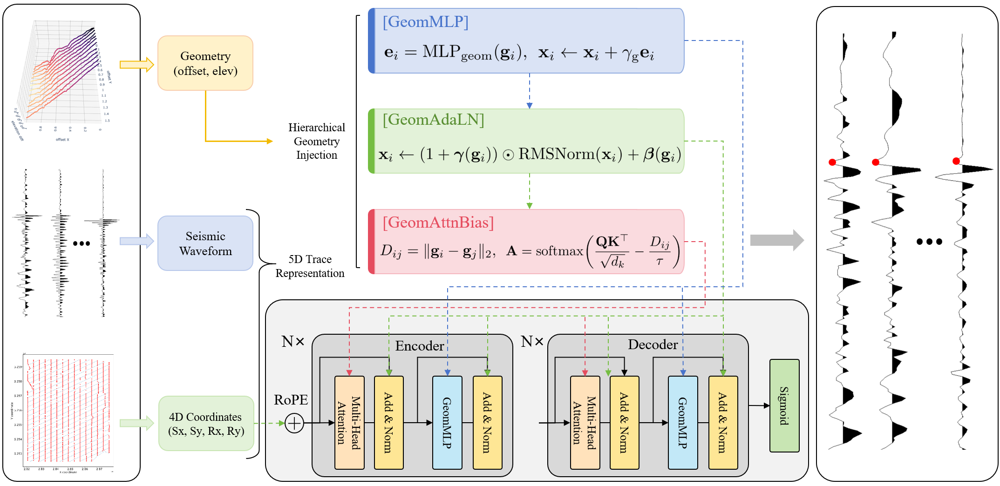
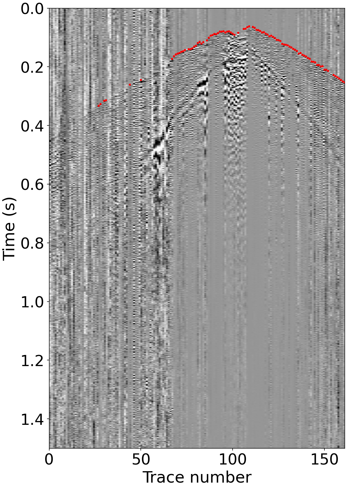
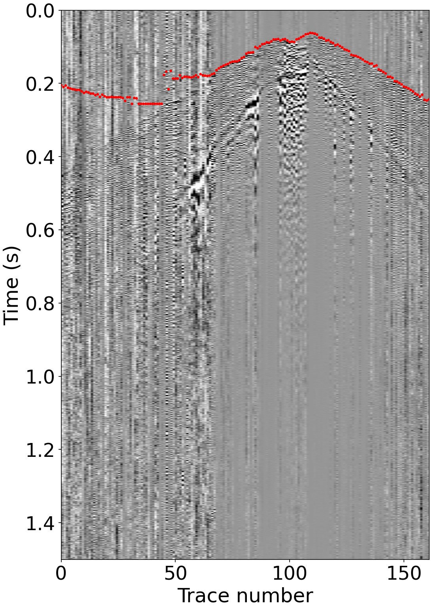
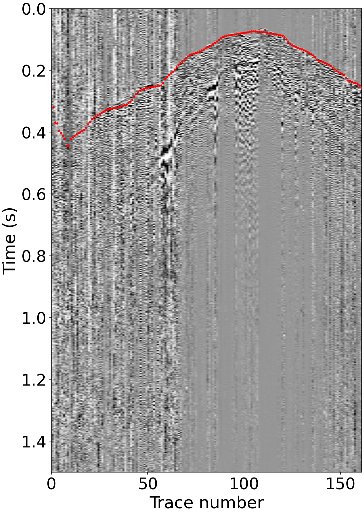

<h1 align="center">🌍 GeoFormer</h1>

<p align="center"><em>Geometry-Aware Transformer and its application to 5D First-Arrival Picking</em></p>

<p align="center">
  <a href="https://arxiv.org/abs/2608.25668"></a>
  <a href="https://huggingface.co/ZDDWLIG/GeoFormer"></a>
  
</p>

**GeoFormer** is a geometry-aware Transformer for automatic first-break picking in 5D seismic data under strong noise. This repository provides the reproduction code for the paper: model architecture, SEG-Y inference pipeline, first-break picking algorithms, and plotting utilities.

---

## 🧠 Method

GeoFormer is built on a **multi-stage gated Transformer encoder–decoder** that extracts multi-scale features from seismic traces. Per-trace geometric attributes (source/receiver coordinates, offset, elevation) are encoded and fused into the network through geometry-conditioned adaptive layer normalization and geometry-aware attention biases. The output is a per-sample first-break probability mask, from which arrival-time picks are recovered by nearest-point picking (NPP) — yielding accurate picks that remain robust under strong noise.

<p align="center">
  
</p>

## 📊 Results

Qualitative comparison on the **Lalor** seismic dataset:

<table align="center">
  <tr>
    <td align="center"><b>(a) Ground truth label</b></td>
    <td align="center"><b>(b) GeoFormer (ours)</b></td>
  </tr>
  <tr>
    <td align="center"></td>
    <td align="center"></td>
  </tr>
  <tr>
    <td align="center"><b>(c) Attention U-Net</b></td>
    <td align="center"><b>(d) ViT</b></td>
  </tr>
  <tr>
    <td align="center"></td>
    <td align="center"></td>
  </tr>
</table>

---

## 📦 Data

The repository ships a sample SEG-Y file for quick testing:

- `test_data/fig4_data.sgy` — sample 5D seismic gather.

Run inference on this file to reproduce the `fig4` results. Generated outputs (picks, predicted mask SEG-Y, and images) are written to `test_results/`.

## 🤗 Model Weights

The best checkpoint (selected on the validation set of the Lalor seismic dataset) is hosted on Hugging Face:

> **https://huggingface.co/ZDDWLIG/GeoFormer**

File: `best_model.pth` (~195 MB). Save it to the `checkpoints/` directory (git-ignored):

```bash
mkdir -p checkpoints
curl -L -o checkpoints/best_model.pth \
  https://huggingface.co/ZDDWLIG/GeoFormer/resolve/main/best_model.pth
```

Alternatively, use `huggingface-cli` (installs only the model file):

```bash
pip install -U "huggingface_hub[cli]"
huggingface-cli download ZDDWLIG/GeoFormer best_model.pth --local-dir checkpoints
```

Or `git lfs` (clones the whole repository):

```bash
git clone https://huggingface.co/ZDDWLIG/GeoFormer checkpoints
```

## ⚙️ Environment Dependencies

Python 3.11+. Install dependencies with:

```bash
pip install -r requirements.txt
```

Pinned versions are listed in `requirements.txt`. For GPU inference, first install a CUDA-enabled PyTorch build following [pytorch.org](https://pytorch.org/get-started/locally/).

## 🚀 Inference

```bash
python inference.py --segy test_data/fig4_data.sgy --model checkpoints/best_model.pth --output test_results/fig4_pred
```

| Argument | Description |
|----------|-------------|
| `--segy` | Input seismic SEG-Y file |
| `--model` | Model checkpoint path |
| `--output` | Output path stem — generates `{output}_picks.txt` and `{output}_pred_mask.sgy` |
| `--batch_size` | Batch size (default: 1) |
| `--device` | Device override, e.g. `cuda:0` or `cpu` (default: auto) |
| `--gpu` | GPU index shortcut, e.g. `--gpu 0` |

Model architecture, normalization parameters, and coordinate bounds are all auto-loaded from `config.json`.

## 🎨 Plotting Results

After inference completes, generate visualization images with:

```bash
python plot_results.py -d test_results --sgy test_data/fig4_data.sgy --picks test_results/fig4_pred_picks.txt
```

Images are saved into the output directory (default: `test_results/`):

| Image | Description |
|-------|-------------|
| `seismic.png` | Raw seismic data displayed in grayscale |
| `pred.png` | Predicted first-break picks overlaid as red scatter points |

## 📖 Citation

If you use this work, please cite:

```bibtex
@misc{gao2026geoformergeometryawaretransformerapplication,
      title={GeoFormer: Geometry-Aware Transformer and its application to 5D First-Arrival Picking},
      author={Tianxiang Gao and Jianwei Ma},
      year={2026},
      eprint={2608.25668},
      archivePrefix={arXiv},
      primaryClass={physics.geo-ph},
      url={https://arxiv.org/abs/2608.25668},
}
```
